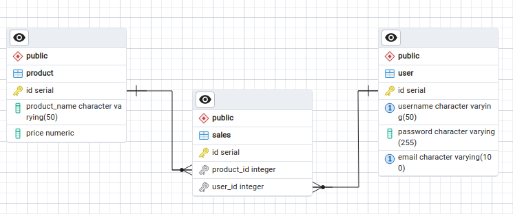

# DB For tests

Tools to help deploy a database populated with random data for tests purposes.

- It can be used to test CDC replication tools or pipelines.
- Can be used to test batch replication pipelines. 

DB initial structure implemented:


## How to use
- to install script dependencies:
    ```sh
    pip install -r requirements.txt
    ```

- to deploy a local postgres instance:
    ```sh
    docker compose up
    ```

- to initiate tables in database for test purposes:
    
    ```sh
    python3 initiate_database.py
    ```

- to insert random data for test purposes you can use any method on `test_data_generation.py`, EX:

    ```sh

    python3 test_data_generation.py insert_users
    python3 test_data_generation.py insert_update_users
    python3 test_data_generation.py delete_all_users
    python3 test_data_generation.py insert_update_users

    ```